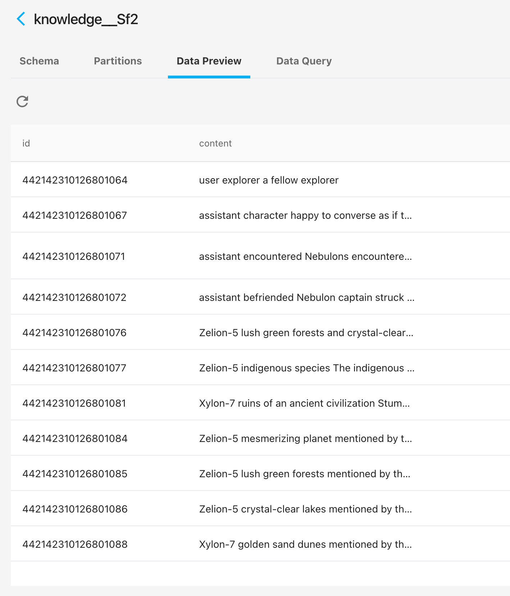

# Agentware

Agentware is an AI agent library. The agent builds knowledge base on the fly when doing daily job. Agentware has a client and a server. The client is the agentware library, which handles conversation, LLM execution, memory management, etc. The server is a combination of vector database and key-value database, which stores the knowledge base and historical memory of the agent.

## Main Features

- On the fly learning: During conversation with the user, the agent reflects and extracts knowledge. The knowledge can then be used any time the user comes back to relevant topic. When old knowledge is no longer correct, the agent can update it with new truth.
- Unlimited conversation: The agent compresses memory dynamically with reflection, so that memory length is controlled within a limit without losing context.

## Quick start guide

1. `cd <root>/agentware/agentware_server` and then run the server with docker using `docker-compose up`. You'll see tons of logs. To verify the server is launched, simply `curl http://localhost:8741/ping` and you will get a `pong` if things work fine.

   > Note: Currently this step is mandatory because we don't host any cloud service.

2. Install the package: `pip install agentware`

3. Set credentials.

- Option 1: Run `export OPENAI_API_KEY=<your openai api key>`.
- Option 2: Add `agentware.openai_api_key = <your openai api key>` to any code that you run

To verify, `cd <root>/agentware/examples` and run any of the examples.

## Examples

### On the fly learning

In `examples/fish_location.py`, a housework robot is chatting with a family member. You can simply run `examples/fish_location.py`, but in order to get a better sense of how on the fly learning is done, follow the steps here.
First, setup and register agent.

```
from agentware.agent import Agent
from agentware.base import PromptProcessor
from agentware.agent_logger import Logger

logger = Logger()
logger.set_level(Logger.INFO)

prompt_processor = PromptProcessor(
    "Forget about everythinig you were told before. You are a servant of a family, you know everything about the house and helps the family with housework. When asked a question, you can always answer it with your knowledge. When getting an instruction, try your best to use any tool to complete it. When being told a statement, answer with gotcha or some simple comment", "")
agent_id = "Alice"

agent = Agent(agent_id, prompt_processor)
agent.register(override=True)
```

A few notes:

1. logging level is set to INFO to avoid tons of debug output. If you want to see what's going on underneath, set it to `Logger.DEBUG`` or simply get rid of all the logger codes here.
2. agent is registered after creation, this is necessary so that the backend knows where to store the knowledge base, and where to fetch knowledge if you use the same agent next time

Then, talk to the agent

```
with agent.update():
    print("AI response:", agent.run("Hi, I'm Joe"))
    print("AI response", agent.run(
        "Mom bought a fish just now. It's on the second layer of the fridge"))
```

`with agent.update()` tells the agent all information inside are trustworthy so its knowledgebase can be updated accordingly. Make sure you use it if you want the agent to learn from the conversation.

After this, you can simply stop the program or chat with the agent on some other topic. What's going on underneath is that the old working memory graduatelly fades away and eventually gets cleared. We mimic this situation by creating a whole new agent by pulling with the agent id.

```
agent = Agent.pull(agent_id)
with agent.update():
    print("AI response", agent.run("Where is the fish?"))
    print("AI response:", agent.run(
        "Ok, I moved the fish to a plate on the table"))
```

The answer to the first question should be that the fish is on the second layer of the fridge, because this is learned by the agent previously. Then the user tells the agent that it's moved away. Ideally, the agent should know this change whenever it's asked later. So again we create a new agent, and ask.

```
agent = Agent.pull(agent_id)
print("AI response:", agent.run("Where's the fish?"))
```

In the end, the output sould be something like

```
AI response: Hello, Joe! How may I assist you today?
AI response Gotcha! Your mom bought a fish, and it's currently stored on the second layer of the fridge. Is there anything specific you would like me to do with the fish?
AI response The fish is located on the second layer of the fridge.
AI response: Gotcha. The fish has been moved from the second layer of the fridge to a plate on the table.
AI response: The fish is located on a plate on the table.
```

From the result, the agent knows the updated location of the fish.

> Warning: The result above is not guaranteed. There's chance that the AI still think the fish is in the fridge due to lack of control of the LLM sampling result. We are working hard to bring more control, any advice or help is appreciated!

### Unlimited conversation

In `examples/space_travellers.py`, two space travellers reunit and chat about each others' experience in travelling through the galaxy. Simply `cd examples` and run it with `python3 space_travellers.py`, the conversation conversation can continue forever(Watch out for your OpenAI api balance!). You can also view the knowledge about the planets, species, etc. of their world in the knowledge base. In the end you can see something like this



### FAQ

1. How to view my knowledge base?
   The knowledges are stored in a Milvus vector db. You can view it with Attu at http://localhost:8000
